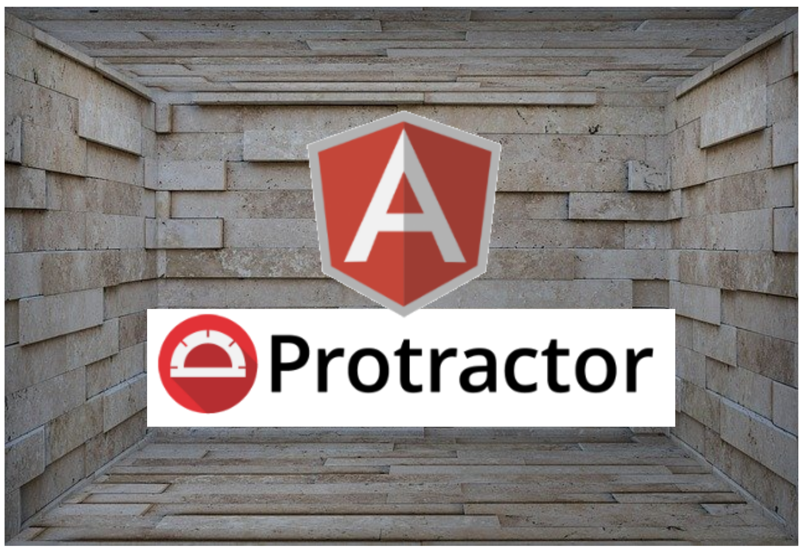

= Angular E2E Testing with json-server

*json-server usage as e2e backend for angular testing*

== Blog: link:https://javaeeblog.wordpress.com/[javaeeblog.wordpress.com]

== Run
[source,shell]
npm run e2e

== Configurations

=== json-server

- installed json server `npm install --save-dev json-server'
- create basic data file link:e2e/json/db.json[db.json]
- create json-server lauch as custom module for maximum flexibility (e.g. handle special urls) link:e2e/json/server.js[server.js]
- we start the json-server within _prepare_-method of protractor, see link:e2e/protractor.conf.js[protractor.conf.js line 28++]
- we use a proxy-config to change target-server to running json server link:e2e/proxy.conf.json[proxy.conf.json]
- we add special serve-profile ("serve-e2e") to _angular.json_ to modify the development server for e2e to add the proxy config
